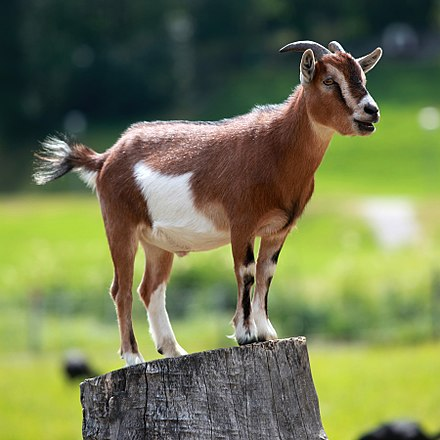
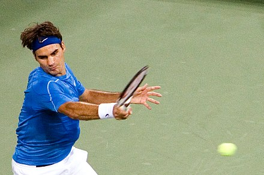
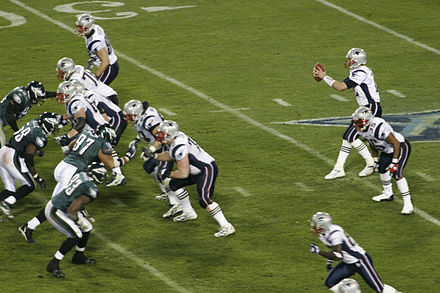
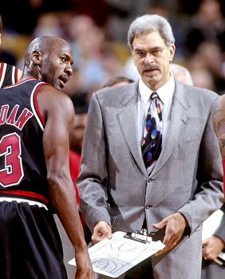

G.O.A.T.s by Matt Resnikoff 
=======
## Created for In-Class Assignment 5 on February 5th, 2018

Over time in sport we've seen some spectacular atheletes. Hundreds and hundreds of incredible people, and yet there are certain people who are regarded as the best of those atheletes. Those rare people, who are the most gifted and acomplished atheletes in their respective sports are refered to as GOATs, which stands for the greatest of all time. In this document we'll look at three of the goatiest goats, Michael Jordan, Tom Brady, and Roger Federer.

Roger Federer
=======
## The Ageless Beloved GOAT

Roger Federer is a Swiss professional tennis player who is currently ranked world No. 2 in men's singles tennis by the Association of Tennis Professionals (ATP). Federer has won 20 Grand Slam singles titles—the most in history for a male player—and has held the world No. 1 spot in the ATP rankings for 302 weeks, including 237 consecutive weeks. After turning professional in 1998, he was continuously ranked in the top ten from October 2002 to November 2016. He re-entered the top ten following his victory at the 2017 Australian Open.

Federer has won a record eight Wimbledon titles, a record six Australian Open titles, a record five consecutive US Open titles, and one French Open title. He is one of eight men to have captured a career Grand Slam. Federer has reached a record 30 men's singles Grand Slam finals, including ten in a row from the 2005 Wimbledon Championships to the 2007 US Open. He reached the semifinals at 23 consecutive Grand Slam tournaments, from the 2004 Wimbledon Championships through the 2010 Australian Open. Federer has won 96 career titles, including six ATP World Tour Finals, 27 ATP World Tour Masters 1000, and 19 ATP World Tour 500 tournaments. Given these achievements, many players and analysts consider Federer to be the greatest tennis player of all time.

Federer's all-court game and versatile style of play involves exceptional footwork and shot-making. Effective both as a base-liner and a volleyer, his apparent effortlessness and efficient movement on the court has made Federer highly popular among his fans. He has been voted by his peers to receive the tour Sportsmanship Award a record thirteen times. Federer has been named the Swiss Sports Personality of the Year a record seven times. He was named ATP Player of the Year five times, was named ITF World Champion five times, and won the Laureus World Sportsman of the Year for a record four consecutive years from 2005–2008. He has won the BBC Overseas Sports Personality of the Year four times.

Tom Brady
=======
## The Cheating/Also Ageless GOAT

Thomas Edward Patrick Brady Jr. (born August 3, 1977) is an American football quarterback for the New England Patriots of the National Football League (NFL). He is one of only two players to win five Super Bowls (the other being defensive player Charles Haley) and the only player to win them all playing for one team.

After playing college football for the University of Michigan, Brady was drafted by the Patriots in the sixth round of the 2000 NFL Draft. In Brady's 16 seasons as a starter, he has quarterbacked the Patriots to eight Super Bowl appearances, the most for any player in history.

Brady has been honored with four Super Bowl MVP awards (Super Bowl XXXVI, XXXVIII, XLIX, and LI), the most ever by a single player, has won three league MVP awards (2007, 2010, 2017), has been selected to 13 Pro Bowls, and has led his team to more division titles (15) than any other quarterback in NFL history. As of the end of the 2017 regular season, Brady is fourth all-time in career passing yards, tied for third (with Drew Brees) in career touchdown passes, and third in career passer rating. His career postseason record is 27–10, winning more playoff games than any other quarterback, and he has appeared in more playoff games than any player at any position. Brady has never had a losing season as a starting quarterback in the NFL. His combined regular-season and postseason wins are also the most of any quarterback in NFL history. Because of his accomplishments and accolades, many analysts and sportswriters consider Brady to be among the greatest quarterbacks of all time. Due to his late draft selection, Brady is considered to be the biggest "steal" in the history of the NFL Draft.

For his alleged involvement in the highly publicized Deflategate football tampering scandal, Brady was suspended for the first four games of the 2016 NFL season. Subsequently, Brady went on to win Super Bowl LI and be awarded Super Bowl MVP that season.

Michael Jordan
=======
## The Air (His Airness) GOAT

Michael Jeffrey Jordan (born February 17, 1963), also known by his initials, MJ, is an American retired professional basketball player, businessman, and principal owner and chairman of the Charlotte Hornets of the National Basketball Association (NBA). Jordan played 15 seasons in the NBA for the Chicago Bulls and Washington Wizards. His biography on the NBA website states: "By acclamation, Michael Jordan is the greatest basketball player of all time." Jordan was one of the most effectively marketed athletes of his generation and was considered instrumental in popularizing the NBA around the world in the 1980s and 1990s.

Jordan played three seasons for coach Dean Smith at the University of North Carolina. As a freshman, he was a member of the Tar Heels' national championship team in 1982. Jordan joined the Bulls in 1984 as the third overall draft pick. He quickly emerged as a league star, entertaining crowds with his prolific scoring. His leaping ability, demonstrated by performing slam dunks from the free throw line in slam dunk contests, earned him the nicknames Air Jordan and His Airness. He also gained a reputation for being one of the best defensive players in basketball. In 1991, he won his first NBA championship with the Bulls, and followed that achievement with titles in 1992 and 1993, securing a "three-peat". Although Jordan abruptly retired from basketball before the beginning of the 1993–94 NBA season and started a new career playing minor league baseball, he returned to the Bulls in March 1995 and led them to three additional championships in 1996, 1997, and 1998, as well as a then-record 72 regular-season wins in the 1995–96 NBA season. Jordan retired for a second time in January 1999, but returned for two more NBA seasons from 2001 to 2003 as a member of the Wizards.

Jordan's individual accolades and accomplishments include five Most Valuable Player (MVP) Awards, ten All-NBA First Team designations, nine All-Defensive First Team honors, fourteen NBA All-Star Game appearances, three All-Star Game MVP Awards, ten scoring titles, three steals titles, six NBA Finals MVP Awards, and the 1988 NBA Defensive Player of the Year Award. Among his numerous accomplishments, Jordan holds the NBA records for highest career regular season scoring average (30.12 points per game) and highest career playoff scoring average (33.45 points per game). In 1999, he was named the greatest North American athlete of the 20th century by ESPN, and was second to Babe Ruth on the Associated Press's list of athletes of the century. Jordan is a two-time inductee into the Basketball Hall of Fame, having been enshrined in 2009 for his individual career, and again in 2010 as part of the group induction of the 1992 United States men's Olympic basketball team ("The Dream Team"). He became a member of the FIBA Hall of Fame in 2015.

Jordan is also known for his product endorsements. He fueled the success of Nike's Air Jordan sneakers, which were introduced in 1985 and remain popular today. Jordan also starred in the 1996 film Space Jam as himself. In 2006, he became part-owner and head of basketball operations for the then-Charlotte Bobcats, buying a controlling interest in 2010. In 2015, Jordan became the first billionaire NBA player in history as a result of the increase in value of NBA franchises. He is the third-richest African-American, behind Oprah Winfrey and Robert F. Smith.
